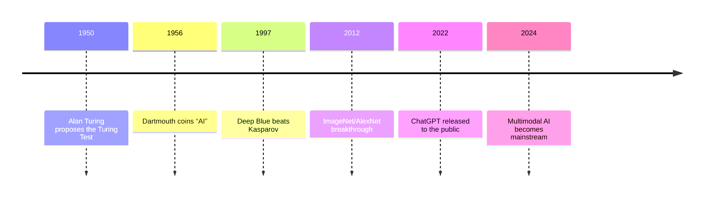
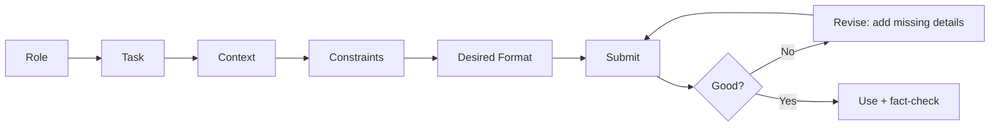

# Welcome

**Getting Started with AI**

### Presenter:

**Garth Tuck**

---
layout: image-right

image: /title-slide.png
---

# Workshop Goals

- Explain generative AI in plain language
- Notice a few ways AI already shows up in daily life
- Practice writing and improving prompts on your phone
- Learn when AI is useful and when you should slow down and verify
- Use AI safely without sharing private or sensitive information
- Leave with one real task you can try this week

---
layout: two-cols-header
---

# Series Agenda + Housekeeping

::left::

### Workshop Environment:
- Open, inclusive, and curiosity-driven

### 3 x 1‑Hour Sessions
- **Session 1 — Foundations:** What GenAI is, what it does well, safety and privacy
- **Session 2 — Prompting + Practice:** Prompt patterns, phone demos, guided hands‑on
- **Session 3 — Apply + Plan:** Everyday workflows and your personal action plan

::right::

### Housekeeping
- Wi‑Fi: [Liahona], Password: [alma3738]
- You can do the activities on your phone
- Pair up if you don’t have a device or account
- Raise your hand for help anytime

---
layout: center
class: text-center
---

# Session 1
**Foundations: What AI is + how to use it safely**

---
layout: two-cols-header
---

# Session 1 Agenda (60 minutes)

::left::

- Welcome + quick intros (5)
- AI in daily life (10)
- Core vocabulary (10)
- Why AI feels different now (10)

::right::

- What ChatGPT is / isn’t (10)
- Privacy + safety basics (10)
- Wrap + prep for Session 2 (5)

---
layout: quote
---

# AI in our world

**Where do you think AI might already be helping you in daily life—without you even realizing it?**

---

# A few examples include:

<v-clicks>

1. **📸 Photo Tagging & Face Recognition** Your phone or social media app automatically groups your photos by faces or places—powered by AI.

2. **🔍 Search Suggestions** As you type, search engines guess what you mean based on past searches and trends—thank AI for that.

3. **🧭 GPS & Maps** AI predicts traffic, suggests faster routes, and updates real-time arrival times.

4. **📺 Streaming Recommendations** Netflix, YouTube, Spotify, etc., use AI to suggest shows or songs based on what you've watched or listened to.

5. **📱 Voice Assistants** Siri, Alexa, and Google Assistant recognize speech, interpret commands, and even hold mini conversations.

6. **📝 Autocorrect & Smart Text Prediction** Your phone suggests the next word or fixes typos as you type—that’s AI anticipating your intent.

7. **🌡️ Smart Home Devices** Thermostats like Nest learn your preferences and adjust temperatures automatically to save energy.

</v-clicks>
---
layout: two-cols-header
---

# Common AI Vocabulary

::left::

<v-clicks>

- **AI (Artificial Intelligence)** A computer system that can perform tasks usually requiring human intelligence (like understanding language or recognizing images).

- **ML (Machine Learning)** A type of AI where computers learn from data and improve over time without being explicitly programmed.

- **GPT (Generative Pre-trained Transformer)** A large language model trained on tons of text to predict and generate human-like responses.

- **LLM (Large Language Model)** A type of AI trained on massive text data to understand and generate human language.

</v-clicks>

::right::

<v-clicks>

- **Token** A piece of a word or character that the AI processes; for example, “chatting” might be split into “chat” and “ting”.

- **Prompt** The input or question you give to an AI—what you type to start the conversation.

- **Training Data** The information (usually lots of text) used to teach the AI how to understand and respond.

- **Inference** The process of the AI generating a response based on your input—it’s “thinking” time for the model.

</v-clicks>

---

# Moments That Matter (AI)

- AI is not brand new.
- What changed recently is **access**: better tools, lower cost, and easier use on phones and laptops.
- For this workshop, the key date is **2022** when conversational AI became easy for the public to try.
---
layout: two-cols-header
---

# Why AI Feels Different Now

::left::

<v-clicks>

- **You can talk to it naturally** It feels more like messaging a helper than programming a machine <a href="https://app.sesame.com/" target="_blank">Conversational Demo</a>

- **It works on the devices people already own** Most people can try it on a phone in minutes.

- **It can handle more than plain text** Some tools can work with voice, images, files, and web results.

</v-clicks>

::right::

<v-clicks>

- **It is built into more apps and services** Search, writing help, photo tools, and assistants now include AI features.

- **The quality can be surprisingly good** That makes it useful, but also easy to trust too quickly.

- **Your judgment still matters** Useful does not mean accurate, fair, private, or appropriate.

</v-clicks>

---
layout: two-cols-header
---

# What ChatGPT Is and Isn’t

::left::

<v-clicks>

## What it’s good at

</v-clicks>

<v-clicks>

- **Drafting and rewriting** → Messages, emails, posts, reminders, and first drafts.

- **Summarizing and organizing** → Turns long text into bullet points, checklists, or short summaries.

- **Planning and brainstorming** → Helps with errands, meal plans, travel ideas, and next steps.

- **Explaining concepts** → Breaks down unfamiliar topics in plain language.

- **Translating and adapting tone** → Rewrites for clearer, friendlier, shorter, or simpler communication.

</v-clicks>

::right::

<v-clicks>

## Limits and cautions

</v-clicks>

<v-clicks>

- **Can be wrong while sounding confident** → Always verify important facts.

- **Not a replacement for experts** → Medical, legal, and financial decisions need trusted sources.

- **May miss local or recent details** → Prices, policies, events, and deadlines can change quickly.

- **Does not know your life unless you tell it** → Missing context leads to generic or off-base answers.

- **Bias and blind spots exist** → Double-check tone, assumptions, and fairness.

</v-clicks>

---

# Privacy & Safety Basics

<v-clicks>

- **Do not paste private, financial, medical, or account information.**

- **Remove names, IDs, addresses, account numbers, and passwords.**

- **Get consent before including someone else's messages, photo, or personal details.**

- **On a phone, check screenshots and photos carefully** before uploading anything.

- **Use summaries or excerpts instead of full documents whenever possible.**

- **Review the tool's privacy settings** and opt out of training use if that matters for your situation.

- **Remember:** "Anonymous" is not always anonymous if the situation is very specific.

- **When in doubt, leave it out** and ask in a more general way.

</v-clicks>

---

# Safer Prompt Example

<v-clicks>

- **Too much:**  
  "Summarize this email from my child's teacher. Her name is ____ and our phone number is ____."

- **Safer:**  
  "Summarize this school message in three bullets. Remove names and personal details. Tell me if there is any action item or deadline."

- **Better habit:**  
  Share only the part you need help with, not the whole thread.

</v-clicks>

---
layout: center
class: text-center
---

# Session 1 Wrap

**One takeaway:** What surprised you most about AI today?  
**One caution:** What will you *avoid* sharing with AI tools?

---
layout: center
class: text-center
---

# Session 2
**Prompting + Practice: getting consistently useful results**

---
layout: two-cols-header
---

# Session 2 Agenda (60 minutes)

::left::

- Quick recap (5)
- One phone demo from start to finish (10)
- What makes a prompt useful (10)
- Prompt patterns (15)

::right::

- Guided phone practice (15)
- Share‑outs + Q&A (5)
- Take‑home task (last 5)

---

# Everyday Tasks That Work Well on a Phone

<v-clicks>

- 💬 **Write or rewrite a message**  
  Ask for a text, email, follow-up, or reminder in a specific tone.

- 📅 **Plan something practical**  
  Organize errands, meals, trips, study time, or a busy week.

- 📚 **Understand something faster**  
  Get a plain-language explanation, a summary, or a short quiz.

- 🌍 **Translate or simplify**  
  Rewrite for a different audience, reading level, or language.

- ✅ **Turn a messy idea into a checklist**  
  Great for starting when you are stuck or overwhelmed.

- ⚠️ **Still verify before acting**  
  Helpful first draft, not a final answer.

</v-clicks>

---
layout: default
---

# Live Demo Flow

1. Start with a real task
2. Ask in a simple, natural sentence
3. Add missing details
4. Ask for a better format
5. Check the result before you use it

### Example phone task

**"Write a short text to reschedule my dentist appointment for next week."**

Then improve it by adding tone, timing, and word limit.

---

# Pick a Starter Task

<v-clicks>

1. 📝 **Message someone**  
   Reschedule, follow up, thank someone, or ask for help.

2. 📅 **Plan your day or week**  
   Ask for a simple schedule that fits your real constraints.

3. 🍽️ **Plan meals or groceries**  
   Use ingredients you already have and a budget you can afford.

4. 📚 **Explain something clearly**  
   Ask for a plain-language explanation with examples.

5. 🛠️ **Brainstorm options**  
   Gifts, events, side projects, or questions to ask before a decision.

6. 🌍 **Translate or adapt**  
   Change language, tone, length, or reading level.

7. ♿ **Make information easier to use**  
   Turn it into a checklist, summary, or simpler version.

</v-clicks>

---

# When the First Answer Misses

- Add **context**: who, what, where, why
- Add **constraints**: budget, time, tone, word count
- Add **format**: text message, bullets, checklist, table
- Add **audience**: friend, coworker, parent, student, customer
- Ask for **another version** instead of starting over

---

# How to write a good prompt

<v-clicks>

</v-clicks>

<v-clicks>

- 🧩 **Be specific**  
  "Write a short text asking to reschedule my appointment" works better than "Help me write something."
- 🗣️ **Use natural language**  
  You do not need special commands. Just describe the task like you would to a helpful assistant.
- 🎨 **Set the tone**  
  Say if you want it friendly, professional, calm, short, direct, or simple.
- 💡 **Give constraints**  
  Include details like audience, deadline, budget, or maximum length.
- 🔁 **Tweak and test**  
  If the first answer is close but not quite right, revise instead of giving up.

 </v-clicks>

---
layout: two-cols-header
---

# Prompt Engineering

::left::
## ❌ Poor Prompt
"Write a text to my landlord."

## 👍🏻 A little better
"Write a polite text to my landlord asking when the dishwasher will be fixed."

::right::
## 🎓 Pro-Level
"Write a short, polite text to my landlord, Jordan.  
The dishwasher has not worked since Monday.  
I already reported it once.  
Ask for an update and suggest a repair window after 5 p.m.  
Keep it under 70 words and sound calm, not angry."

---

# Prompt Ideas You Can Try Right Now

<v-clicks>

1. ✉️ Write a polite message to reschedule my dentist appointment.

2. 🧑‍🍳 Give me 3 simple dinners from these ingredients: [list].

3. 🧠 Explain what a deductible is in plain language.

4. 🧳 Plan a low-cost day trip near [my city] under [$ amount].

5. 📝 Turn these messy notes into a checklist: [paste notes].

6. 🌍 Translate this text into [language] and keep it friendly.

</v-clicks>

---
layout: two-cols-header
---

# Group Activity - Try It on Your Phone

::left::

- **<u>Timebox: 10 minutes</u>**
- Open your AI app or mobile browser
- Pick **one real task** from the previous slide
- Start with a simple prompt
- Improve it by adding:
  - context
  - constraints
  - desired format
- Save your best version with a screenshot or note
- Pair up if you need a device or account

::right::

### Share back

- What task did you choose?
- What changed when you improved the prompt?
- What part of the answer still needed your judgment?

---
layout: two-cols-header
---

# Take‑Home Task

::left::

### Goal (20–30 minutes)
Pick one real task you do at work, school, home, church, or in your community and use AI to improve it.

**Choose one:**
- Draft an email/message
- Plan a week or event
- Learn something (explain + quiz me)
- Create something useful (recipe, outline, checklist, flyer text)

::right::

### What to bring back
- Your **best prompt**
- The **best AI output** or a screenshot
- **2 improvements** you made
- One thing you **still had to check or fix**

---
layout: center
class: text-center
---

# Session 3
**Apply + Plan: workflows, tools, and your personal action plan**

---
layout: two-cols-header
---

# Session 3 Agenda (60 minutes)

::left::

- Share homework wins + lessons (15)
- A few practical workflows (15)
- Choosing the right tool for the job (10)

::right::

- Optional phone features (10)
- Personal “AI starter kit” plan (5)
- Q&A + next steps (5)

---
layout: center
class: text-center
---

# Homework Share-Out

**Share with the group:**

- Your best prompt
- The most useful output you got
- One thing you changed to improve the result
- What surprised you — or what didn't work?

---
layout: two-cols-header
---

# Practical Workflows: AI in Action

::left::

### ✉️ Message Workflow
1. **Draft** — "Write a short follow-up text after today's meeting."
2. **Refine** — "Make it warmer and cut it to 60 words."
3. **Verify** — Check tone, names, dates, and next steps.

### 📋 Planning Workflow
1. **Brainstorm** — "Give me 8 ways to make weeknights less rushed."
2. **Filter** — "Pick the 3 easiest for a busy household."
3. **Expand** — "Turn those into a simple plan for this week."

::right::

### 🔍 Research Workflow
1. **Ask** — "Explain [topic] in simple terms."
2. **Clarify** — "What are the main options, pros, and cons?"
3. **Verify** — Confirm key facts with a trusted source or local policy.

### 🧠 The Golden Rule
> AI gives you a **first draft**, not a final answer.  
> You bring the judgment, context, and verification.

---
layout: center
class: text-center
---

# Choose the Right Tool for the Job

<v-clicks>

- **General chat tools** are good for drafting, explaining, brainstorming, and planning.
- **Research-focused tools** are better when you want links or cited sources.
- **Built-in assistants** inside search, phones, or office software can be convenient for quick tasks.
- The exact brand matters less than the workflow:
  ask clearly, review carefully, and verify important details.

</v-clicks>

---

# How to Compare Tools Without Overthinking It

<v-clicks>

- Does it work well on **your phone**?
- Can you use it for **free or low cost**?
- Does it give **sources** when you need them?
- Are the **privacy settings** acceptable for your situation?
- Does it support the format you need: text, voice, image, or file upload?

</v-clicks>

---
layout: center
---

# Optional Phone Features to Explore

### 🎨 Image Help
- Describe a flyer, social post, or visual idea
- Ask for better wording before you generate anything

### 🎙️ Voice
- Talk instead of type for quick questions
- Still verify the answer before acting on it

### 📷 Camera / Photo Input
- Ask for help describing, reading, or organizing what is in an image
- Be careful not to upload private information by accident

---
layout: two-cols-header
---

# Your Personal AI Starter Kit

::left::

### Choose your tool
- ☐ ChatGPT
- ☐ Claude
- ☐ Gemini
- ☐ Other: ___________

### Choose your first use case
- ☐ Email / messages
- ☐ Planning / scheduling
- ☐ Learning / research
- ☐ Community / volunteer work
- ☐ Other: ___________

::right::

### Write your first prompt
Use this template:

> "I need help with [task].  
> Context: [relevant details].  
> Keep it [tone / length / reading level].  
> Format it as [text / bullets / checklist / table]."

### Commit to one thing
Tell one person what you tried — and what happened.

### Keep one safety habit
Remove names and sensitive details before you paste anything.

---
layout: center
class: text-center
---

# What's Next

**The skill is in the iteration — keep practicing.**

- 🤖 **ChatGPT** — <a href="https://chatgpt.com" target="_blank">chatgpt.com</a>
- 🧠 **Claude** — <a href="https://claude.ai" target="_blank">claude.ai</a>
- 🔍 **Gemini** — <a href="https://gemini.google.com" target="_blank">gemini.google.com</a>
- 📰 **Perplexity** (research with sources) — <a href="https://perplexity.ai" target="_blank">perplexity.ai</a>
- 📖 **Learn Prompting** (free guide) — <a href="https://learnprompting.org" target="_blank">learnprompting.org</a>

**This week:** use AI for one small real task, then decide whether it actually saved you time.

---

# Questions?

---
# Thank You

Thanks for your time.

Want more? Start with one small task and keep iterating:

- 🤖 <a href="https://chatgpt.com" target="_blank">chatgpt.com</a> — OpenAI's ChatGPT
- 🧠 <a href="https://claude.ai" target="_blank">claude.ai</a> — Anthropic's Claude
- 🔍 <a href="https://gemini.google.com" target="_blank">gemini.google.com</a> — Google's Gemini
