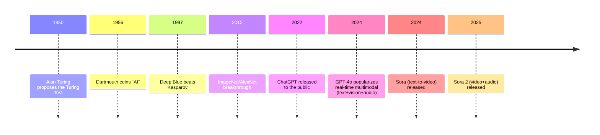
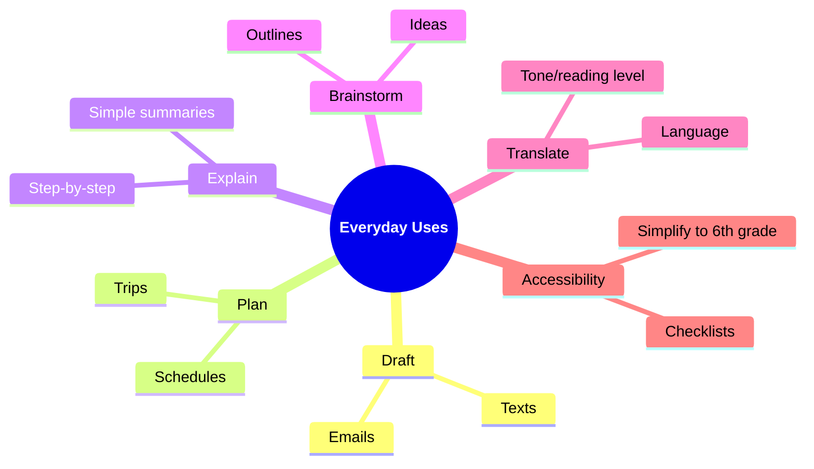
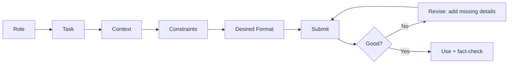

# Welcome

**Getting Started with AI**

### Presenter:

**Garth Tuck**

---
layout: image-right

image: /title-slide.png
---

# Workshop Goals:

- Understand what generative AI is and how it works  
- Explore real-world examples of how AI already impacts our lives  
- A few milestones in AI history and key AI vocabulary and concepts  
- Practice writing effective prompts to get helpful responses from ChatGPT  
- Try hands-on tools and leave with ideas you can apply right away  
- Build a mini “AI starter kit” across **3 one‑hour sessions** (with a take‑home task)  
- Have FUN!!!

---
layout: two-cols-header
---

# Series Agenda + Housekeeping

::left::

### Workshop Environment:
- Open, inclusive, and curiosity-driven

### 3 x 1‑Hour Sessions
- **Session 1 — Foundations:** What GenAI is, vocabulary, milestones, safety & privacy
- **Session 2 — Prompting + Practice:** Prompt patterns, demos, guided hands‑on
- **Session 3 — Apply + Plan:** Tools landscape, workflows, your personal action plan

::right::

### Housekeeping
- Wi‑Fi: [Liahona], Password: [alma3738]
- Pair up if you don’t have a device
- Raise your hand for help anytime
         

---
layout: center
class: text-center
---

# Session 1
**Foundations: What AI is + how to use it safely**

---
layout: two-cols-header
---

# Session 1 Agenda (60 minutes)

::left::

- Welcome + quick intros (5)
- AI in daily life (10)
- Core vocabulary (10)
- Key milestones (10)

::right::

- What ChatGPT is / isn’t (10)
- Privacy + safety basics (10)
- Wrap + prep for Session 2 (5)
         

---
layout: quote
---

# AI in our world

**Where do you think AI might already be helping you in daily life—without you even realizing it?**

---

# A few examples include:

<v-clicks>

1. **📸 Photo Tagging & Face Recognition** Your phone or social media app automatically groups your photos by faces or places—powered by AI.

2. **🔍 Search Suggestions** As you type, search engines guess what you mean based on past searches and trends—thank AI for that.

3. **🧭 GPS & Maps** AI predicts traffic, suggests faster routes, and updates real-time arrival times.

4. **📺 Streaming Recommendations** Netflix, YouTube, Spotify, etc., use AI to suggest shows or songs based on what you've watched or listened to.

5. **📱 Voice Assistants** Siri, Alexa, and Google Assistant recognize speech, interpret commands, and even hold mini conversations.

6. **📝 Autocorrect & Smart Text Prediction** Your phone suggests the next word or fixes typos as you type—that’s AI anticipating your intent.

7. **🌡️ Smart Home Devices** Thermostats like Nest learn your preferences and adjust temperatures automatically to save energy.

</v-clicks>
---
layout: two-cols-header
---

# Common AI Vocabulary

::left::

<v-clicks>

- **AI (Artificial Intelligence)** A computer system that can perform tasks usually requiring human intelligence (like understanding language or recognizing images).

- **ML (Machine Learning)** A type of AI where computers learn from data and improve over time without being explicitly programmed.

- **GPT (Generative Pre-trained Transformer)** A large language model trained on tons of text to predict and generate human-like responses.

- **LLM (Large Language Model)** A type of AI trained on massive text data to understand and generate human language.

</v-clicks>

::right::

<v-clicks>

- **Token** A piece of a word or character that the AI processes; for example, “chatting” might be split into “chat” and “ting”.

- **Prompt** The input or question you give to an AI—what you type to start the conversation.

- **Training Data** The information (usually lots of text) used to teach the AI how to understand and respond.

- **Inference** The process of the AI generating a response based on your input—it’s “thinking” time for the model.

</v-clicks>

---

# Moments That Matter (AI)

<v-clicks>

- 1950 — Turing Test proposed (Can machines converse like humans?)
- 1956 — Dartmouth workshop coined the term “Artificial Intelligence”
- 1997 — Deep Blue defeats Garry Kasparov (chess milestone)
- 2012 — ImageNet/AlexNet sparks the modern deep learning boom
- 2022 — ChatGPT released to the public
- 2024 — GPT‑4o brings text, vision, and audio together in one model
- 2024 — Sora brings text‑to‑video to mainstream users
---
layout: two-cols-header
---

# More AI Milestones

::left::

<v-clicks>

- **2011 – IBM Watson Wins Jeopardy!** Defeats human champions with deep NLP (Natural Language Processing) and fact retrieval.

- **2012 – ImageNet & AlexNet Breakthrough** Deep learning revolution begins with CNNs (Convolutional Neural Networks) and visual recognition success.

- **2016 – AlphaGo Beats Lee Sedol** Reinforcement learning and self-play reach new levels of strategy.

- **2020 – GPT-3 Released by OpenAI** Natural language generation reaches astonishing fluency and scale.

</v-clicks>

::right::

<v-clicks>

- **2022 – ChatGPT Goes Mainstream** Conversational AI enters daily use with GPT-powered assistants.

- **2023 – AI-Generated Art and Code Boom** Tools like DALL·E, Copilot, and Midjourney reshape creative and coding work.

- **2024 – GPT‑4o (Multimodal) Release** A major step toward seamless text, image, and voice experiences.

- **2025 – Sora 2 Release** Video + audio generation in a single system.

</v-clicks>
 
 
 

---
layout: two-cols-header
---

# What ChatGPT Is and Isn’t

::left::

<v-clicks>

## What it’s good at

</v-clicks>

<v-clicks>

- **Drafting and rewriting** → Generates first drafts, refines text, and adapts tone or style.

- **Summarizing and outlining** → Condenses long materials into key points or structured outlines.

- **Brainstorming ideas** → Sparks creativity for names, titles, lessons, or storylines.

- **Explaining concepts** → Breaks down complex topics in plain language or step-by-step guides.

- **Tutoring and learning aid** → Provides examples, explanations, and feedback for study or practice.

</v-clicks>

::right::

<v-clicks>

## Limits and cautions

</v-clicks>

<v-clicks>

- **Can be wrong (“hallucinations”)** → May sound confident but provide incorrect information; always verify.

- **Not medical, legal, or financial advice** → Use for learning, not for professional decision-making.

- **May be out of date** → Some models don’t have live data; ask for sources or updates.

- **Privacy matters** → Don’t share personal, confidential, or proprietary information.

- **Biases exist** → Reflects training data patterns; double-check for fairness or accuracy.

</v-clicks>

---

# Privacy & Safety Basics

<v-clicks>

- **Don't share private, financial, or sensitive information.**

- **Remove names, IDs, and other identifiers before sharing content.**

- **Get consent before including others' information or photos.**

- **Review the AI platform's privacy policy** to understand how your data is used or stored.

- **Opt out** of data being used for model training, if possible.

- **Follow all legal and institutional privacy requirements** (FERPA, HIPAA, GDPR, etc.).

- **Remember:** Even "anonymized" data may still be identifiable if context is unique or detailed.

- **Use summaries or excerpts instead of uploading full files.**

</v-clicks>

---

# Checklist Before Sharing

<v-clicks>

- **Does this include sensitive/personal/financial info?**
  - ➔ Redact or remove details; ensure it's truly anonymized.

- **Are other people referenced?**
  - ➔ Get explicit consent, or further anonymize content.

- **Need to upload a file?**
  - ➔ Use excerpts or summaries; remove sensitive data.
  
- **Have you checked the platform's privacy policy and settings?**

</v-clicks>

---
layout: center
class: text-center
---

# Session 1 Wrap

**One takeaway:** What surprised you most about AI today?  
**One caution:** What will you *avoid* sharing with AI tools?

---
layout: center
class: text-center
---

# Session 2
**Prompting + Practice: getting consistently useful results**

---
layout: two-cols-header
---

# Session 2 Agenda (60 minutes)

::left::

- Quick recap (5)
- What you can do with ChatGPT (10)
- Live demos (10)
- Prompt patterns (15)

::right::

- Guided practice (15)
- Share‑outs + Q&A (5)
- Homework assignment (last 5)
         

---

# A few common ways AI is used today

<v-clicks>

- 💬 **Conversational Assistants:**  
  Chatbots like ChatGPT, Google Gemini, and Claude help answer questions and automate everyday tasks.

- 🎨 **Image and Art Generation:**  
  Tools such as DALL·E and Midjourney can create unique images from simple text prompts.

- 📈 **Business Productivity:**  
  Automate emails, summarize meetings, write reports, and generate marketing content.

- 🧠 **Education & Tutoring:**  
  Personalized explanations, homework help, and support for language learning.

- 🎙️ **Realistic Voice Companions:**  
  Platforms such as Sesame offer expressive AI voices for lifelike conversation.

- 🎥 **AI Video Creation:**  
  Text‑to‑video tools evolve fast. OpenAI’s Sora 2 exists, but the Sora web/app is scheduled to be discontinued on **April 26, 2026**—so we’ll treat video demos as “optional” and have alternatives ready.

</v-clicks>

---
layout: center
---

# <a href="https://app.sesame.com/" target="_blank">Conversational voice demo</a>

---
layout: center
---

# Video creation demos

### <a href="https://sora.chatgpt.com/explore" target="_blank">Sora (while available)</a>
### <a href="https://runwayml.com/" target="_blank">Runway</a>
### <a href="https://pika.art/" target="_blank">Pika</a>
---
layout: center
---

# <a href="https://chatgpt.com" target="_blank">ChatGPT demo</a>

---

# A few practical ways to use ChatGPT

<v-clicks>

1. 📝 **Draft Emails or Messages**  
   Quickly write polite, professional, or friendly emails and texts.

2. 📅 **Plan Your Day or Week**  
   Request a customized daily schedule tailored to your tasks and preferences.

3. 🍽️ **Meal Planning and Recipes**  
   Get meal ideas based on ingredients you have or dietary needs.

4. 📚 **Explain Complex Topics Simply**  
   Ask for an easy-to-understand explanation of concepts like credit scores or climate change.

5. 🛠️ **Brainstorm Ideas**  
   Generate creative ideas for gifts, events, projects, or side hustles.

6. 🌍 **Translate and Adapt**  
   Translate messages and adjust tone/reading level for your audience.

7. ♿ **Accessibility Helpers**  
   Simplify to a 6th‑grade reading level or generate step‑by‑step checklists.

</v-clicks>

---

---

# How to write a good prompt

<v-clicks>

</v-clicks>

<v-clicks>

- 🧩 **Be specific**  
  "Tell me a bedtime story about a robot and a cat" vs. "Write a story"
- 🗣️ **Use natural language**  
  Pretend you're talking to a helpful friend, not coding a machine.
- 🎨 **Set the tone**  
  Want it funny? Professional? Thoughtful? Just say so!
- 💡 **Give examples**  
  "Make it sound like a Shakespearean poem" or "List it like a recipe."
- 🔁 **Tweak and test**  
  If the first response isn't great, try rewording or asking from a new angle!

 </v-clicks>

---
layout: two-cols-header
---

# Prompt Engineering

::left::
## ❌ Poor Prompt
"Write something about dogs."

## 👍🏻 A little better
“Write a friendly and informative 3-paragraph article for a blog about the benefits of owning a dog, focusing on companionship, exercise, and mental health.”

::right::
## 🎓 Pro-Level
 "Write a warm, conversational 3-paragraph blog article that explains the benefits of owning a dog.  
 - **Paragraph 1:** Introduce why dogs make great companions and how they enrich daily life.  
 - **Paragraph 2:** Describe how owning a dog encourages physical activity and outdoor exercise.  
 - **Paragraph 3:** Explain how dogs support mental health and emotional well-being.  
 Use friendly language, relatable examples, and an uplifting tone suitable for a lifestyle blog."

---

# Prompt Ideas You Can Try Right Now

<v-clicks>

1. ✉️ Write a polite message to reschedule my dentist appointment.

2. 🧑‍🍳 Give me a 3-day healthy meal plan with simple recipes.

3. 🧠 Explain how interest rates work like I’m in 9th grade.

4. 🧳 Suggest a weekend getaway near [a city] under $300.

5. 🎁 What’s a fun birthday gift idea for a 12-year-old who loves space?

6. 🐶 Write a funny haiku about a dog who’s afraid of squirrels.

</v-clicks>

---
layout: two-cols-header
---

# Group Activity - Try ChatGPT yourself!

::left::

- **<u>Timebox: 10 minutes</u>**
- On your phone or a shared device:
  - Scan the QR code to open chatgpt.com →
- **<u>Enter your prompt:</u>**
  - Example: Plan a 3-day Southern Utah road trip with kids (ages 12, 9, 6).
  - Now, try changing the destination or group type.
- No smartphone? Pair with a neighbor.
- Share your results with the group (2–3 volunteers)

::right::

 
 
 

---
layout: two-cols-header
---

# Take‑Home Task (Homework)

::left::

### Goal (20–30 minutes)
Pick a real task you do at work, school, or home and use ChatGPT to improve it.

**Choose one:**
- Draft an email/message
- Plan a week (schedule + priorities)
- Learn something (explain + quiz me)
- Create something (lesson plan, recipe, outline, story)

::right::

### What to bring back
- Your **best prompt**
- The **best AI output** (copy/paste)
- **2 improvements** you made (what you changed in the prompt)
- A quick note: **What worked? What didn’t?**

         

---
layout: center
class: text-center
---

# Session 3
**Apply + Plan: workflows, tools, and your personal action plan**

---
layout: two-cols-header
---

# Session 3 Agenda (60 minutes)

::left::

- Share homework wins + lessons (15)
- A few practical workflows (15)
- Tools landscape (10)

::right::

- Optional multimodal demos (10)
- Personal “AI starter kit” plan (5)
- Q&A + next steps (5)
         

---
layout: center
class: text-center
---

# Homework Share-Out

**Share with the group:**

- Your best prompt
- The most useful output you got
- One thing you changed to improve the result
- What surprised you — or what didn't work?

---
layout: two-cols-header
---

# Practical Workflows: AI in Action

::left::

### ✉️ Email Workflow
1. **Draft** — "Write a professional follow-up after a meeting."
2. **Refine** — "Make it shorter with a clear call to action."
3. **Verify** — Read it yourself before sending.

### 📋 Planning Workflow
1. **Brainstorm** — "List 10 ways to improve my morning routine."
2. **Filter** — "Pick the 3 most practical for a busy parent."
3. **Expand** — "Build a 1-week plan to try them."

::right::

### 🔍 Research Workflow
1. **Ask** — "Explain [topic] in simple terms."
2. **Dig deeper** — "What are the pros and cons?"
3. **Verify** — Confirm key facts with a trusted source.

### 🧠 The Golden Rule
> AI gives you a **first draft**, not a final answer.  
> You bring the judgment, context, and verification.

---
layout: center
class: text-center
---

# Major AI Providers (2026)
**🤖 Leaders shaping the AI ecosystem**

  <!-- OpenAI -->
  

    
    OpenAI (ChatGPT)
  

  <!-- Anthropic -->
  

    
    Anthropic (Claude)
  

  <!-- Google (Gemini) -->
  

    
    Google (Gemini)
  

  <!-- Perplexity -->
  

    
    Perplexity
  

  <!-- Meta (LLaMA) -->
  

    
    Meta (LLaMA)
  

  <!-- xAI (Grok) -->
  

    
    xAI (Grok)
  

---

# AI Tools at a Glance

| Tool | Best For | Free Tier | Live Web | Image Gen |
|---|---|---|---|---|
| **ChatGPT** | Writing, coding, general use | ✅ | ✅ | ✅ DALL·E |
| **Claude** | Long docs, nuanced writing | ✅ | ✅ | ❌ |
| **Gemini** | Google Workspace integration | ✅ | ✅ | ✅ |
| **Perplexity** | Research with citations | ✅ | ✅ | ❌ |
| **Copilot** | Microsoft 365 / coding | ✅ | ✅ | ✅ |
| **Meta AI** | Casual chat, social platforms | ✅ | ✅ | ✅ |

---
layout: center
---

# Optional: Multimodal Demos

### 🎨 Image Generation
- <a href="https://chat.openai.com" target="_blank">ChatGPT (DALL·E)</a> — describe a scene, get an image
- <a href="https://gemini.google.com" target="_blank">Gemini</a> — Google's image creation tool

### 🎙️ Voice
- <a href="https://app.sesame.com/" target="_blank">Sesame</a> — lifelike AI voice companion
- ChatGPT Voice Mode (mobile app)

### 🎥 Video Generation
- <a href="https://runwayml.com/" target="_blank">Runway</a> — text-to-video
- <a href="https://pika.art/" target="_blank">Pika</a> — short video from prompts

---
layout: two-cols-header
---

# Your Personal AI Starter Kit

::left::

### Choose your tool
- ☐ ChatGPT
- ☐ Claude
- ☐ Gemini
- ☐ Other: ___________

### Choose your first use case
- ☐ Email / messages
- ☐ Planning / scheduling
- ☐ Learning / research
- ☐ Creative writing
- ☐ Other: ___________

::right::

### Write your first prompt
Use this template:

> "Act as a [role]. Help me [task].  
> Context: [relevant details].  
> Format the response as [bullets / paragraph / table]."

### Commit to one thing
Tell one person what you tried — and what happened.

---
layout: center
class: text-center
---

# What's Next

**The skill is in the iteration — keep practicing.**

- 🤖 **ChatGPT** — <a href="https://chatgpt.com" target="_blank">chatgpt.com</a>
- 🧠 **Claude** — <a href="https://claude.ai" target="_blank">claude.ai</a>
- 🔍 **Gemini** — <a href="https://gemini.google.com" target="_blank">gemini.google.com</a>
- 📰 **Perplexity** (research with sources) — <a href="https://perplexity.ai" target="_blank">perplexity.ai</a>
- 📖 **Learn Prompting** (free guide) — <a href="https://learnprompting.org" target="_blank">learnprompting.org</a>

---

# Questions?

---
layout: image-left

image: end-slide.png
---

# Happy trails!

👋🏻 Thanks for your time.

💡 Want more? Jump in and start exploring:

- 🤖 <a href="https://chatgpt.com" target="_blank">chatgpt.com</a> — OpenAI's ChatGPT
- 🧠 <a href="https://claude.ai" target="_blank">claude.ai</a> — Anthropic's Claude
- 🔍 <a href="https://gemini.google.com" target="_blank">gemini.google.com</a> — Google's Gemini